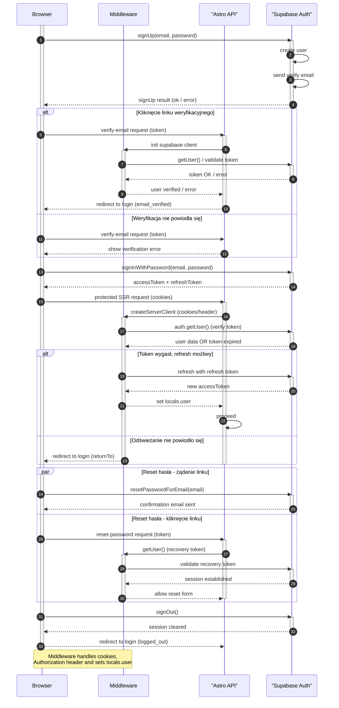

<authentication_analysis>
- Wypisane przepływy autentykacji:
  1) Rejestracja (signUp)
  2) Weryfikacja e-mail (link z Supabase)
  3) Logowanie (signInWithPassword)
  4) Reset hasła (resetPasswordForEmail + updateUser)
  5) Wylogowanie (signOut)
  6) Usunięcie konta (DELETE /api/account z admin key)
  7) Dostęp do chronionych stron (auth guard + redirect)
  8) Zarządzanie sesją i odświeżanie tokenu (access/refresh)

- Główni aktorzy i interakcje:
  - Przeglądarka (Browser) — formularze, kliknięcia linków, żądania
  - Middleware — tworzy per-request Supabase client, czyta cookies/header
  - Astro API / SSR pages — strony serwera (redirecty, render)
  - Supabase Auth — generowanie tokenów, weryfikacja, email, RLS

- Procesy weryfikacji i odświeżania tokenów:
  - Access token (JWT) ma krótkie TTL (np. 1h), refresh token dłuższy
  - SDK Supabase automatycznie odświeża access token gdy możliwe
  - Middleware odczytuje token z cookies lub Authorization header
  - Przy wygaśnięciu refresh token wymagana ponowna autoryzacja

- Krótki opis kroków autentykacji:
  1. Rejestracja: Browser -> SupabaseAuth signUp -> email weryfik.
  2. Weryfikacja: Klik link -> SSR sprawdza status -> redirect.
  3. Logowanie: Browser -> SupabaseAuth signIn -> SDK zapisuje sesję.
  4. Sesja SSR: Middleware odczytuje cookies -> getUser -> locals.user.
  5. Odświeżanie: SDK używa refresh token gdy access wygasł.
  6. Reset hasła: Browser -> SupabaseAuth resetPasswordForEmail -> link -> reset.
  7. Wylogowanie: Browser -> SupabaseAuth signOut -> redirect.
</authentication_analysis>

<mermaid_diagram>

</mermaid_diagram>

