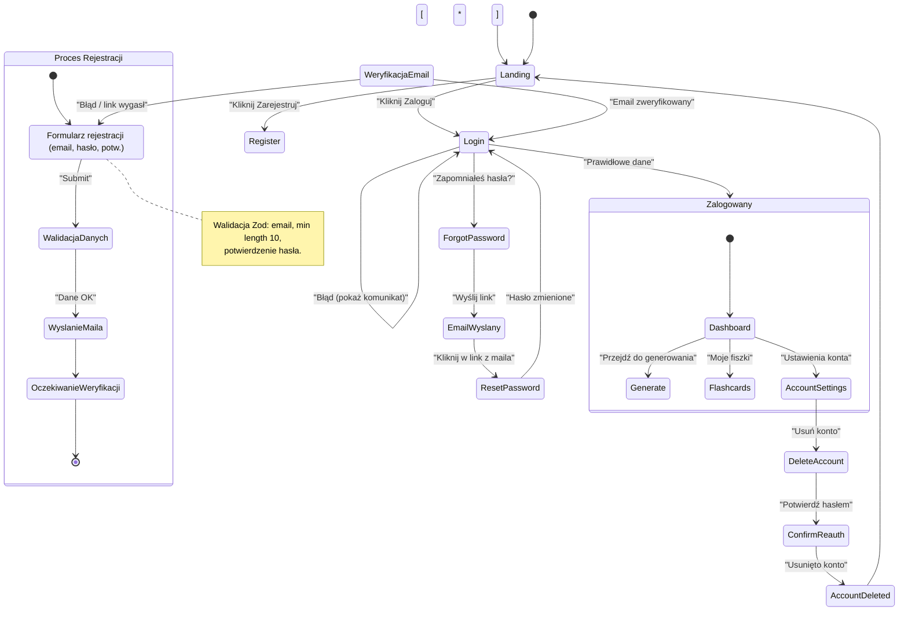

<user_journey_analysis>

- Ścieżki użytkownika wymienione w PRD/specyfikacji:
  1. Gość → Rejestracja
  2. Rejestracja → Weryfikacja email
  3. Gość → Logowanie
  4. Zalogowany → Korzystanie z funkcji (generate, flashcards)
  5. Zapomniałem hasła → Reset hasła
  6. Ustawienia konta → Usunięcie konta
  7. Próba dostępu do chronionej strony bez logowania → redirect do login

- Główne podróże i stany:
  - Niezalogowany (Landing, Login, Register, ForgotPassword)
  - Proces rejestracji (formularz, walidacja, email wysłany)
  - Weryfikacja email (klik link, potwierdzenie)
  - Zalogowany (Dashboard, Generate, Flashcards, Account)
  - Reset hasła (request, link, set new password)
  - Usunięcie konta (confirm, reauth, delete)

- Punkty decyzyjne i alternatywy:
  - Czy email zweryfikowany? (tak → login możliwy; nie → komunikat)
  - Czy token resetu ważny? (tak → reset; nie → poproś o nowy link)
  - Czy user ma uprawnienia do zasobu? (tak → 200; nie → 403/404)

- Krótki opis celu każdego stanu:
  - Login: umożliwić dostęp do chronionych zasobów
  - Register: utworzyć konto i wysłać email weryfik.
  - Verify: potwierdzić adres email i aktywować konto
  - ForgotPassword/Reset: umożliwić odzyskanie dostępu
  - AccountSettings/Delete: zarządzanie i trwałe usunięcie danych
    </user_journey_analysis>

<mermaid_diagram>

</mermaid_diagram>
