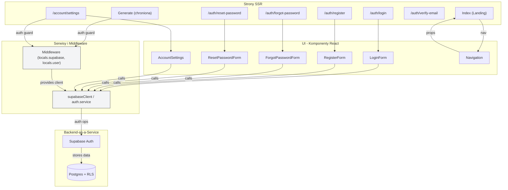

<architecture_analysis>
- Komponenty wymienione w PRD/specyfikacji:
  - Strony Astro: login, register, forgot-password, reset-password,
    verify-email, account/settings, generate, index
  - Komponenty React: LoginForm, RegisterForm, ForgotPasswordForm,
    ResetPasswordForm, AccountSettings, Navigation
  - Serwisy: auth.service, supabase.client
  - Middleware: /src/middleware/index.ts (locals.supabase, locals.user)

- Główne strony i odpowiadające komponenty:
  - /auth/login -> LoginForm
  - /auth/register -> RegisterForm
  - /auth/forgot-password -> ForgotPasswordForm
  - /auth/reset-password -> ResetPasswordForm
  - /account/settings -> AccountSettings
  - Layout -> Navigation (renders based on isAuthenticated)

- Przepływ danych między komponentami:
  - Layout SSR pobiera locals.user i przekazuje props do Navigation
  - Formularze wywołują auth.service / supabaseClient bezpośrednio
  - Middleware udostępnia supabase client per request

- Krótki opis funkcjonalności komponentów:
  - LoginForm: walidacja, signInWithPassword, obsługa błędów
  - RegisterForm: walidacja, signUp, informacja o emailu weryfik.
  - Navigation: show links based on auth state, signOut
  - AccountSettings: reauth + delete account flow
</architecture_analysis>

<mermaid_diagram>

</mermaid_diagram>

